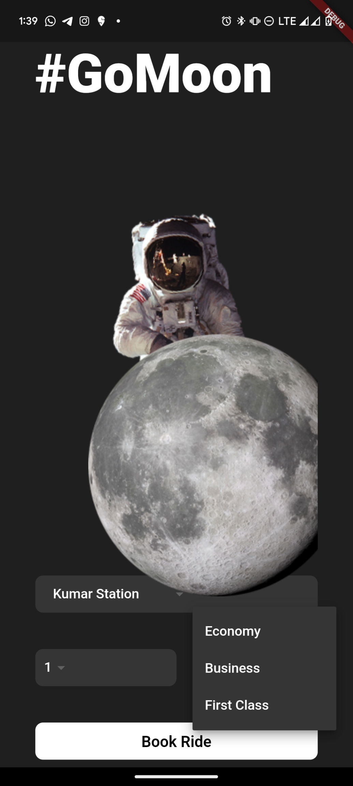

# go_mars

Flutter Learning Project 1 -- Go Mars

## Description and outcomes

- This project is a starting point for my Flutter application Development Journey.
- This project is simple, and I learnt about,
    - Widgets
    - DropDownMenu
    - Layers/Stack
    - Columns and Rows
    - Alignments
    - Buttons

## ScreenShots

